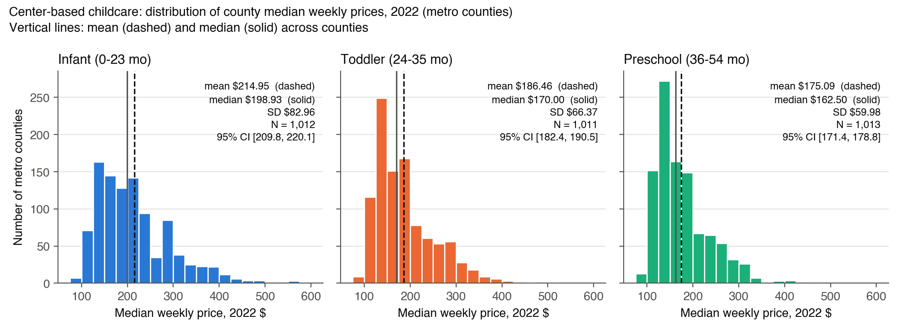
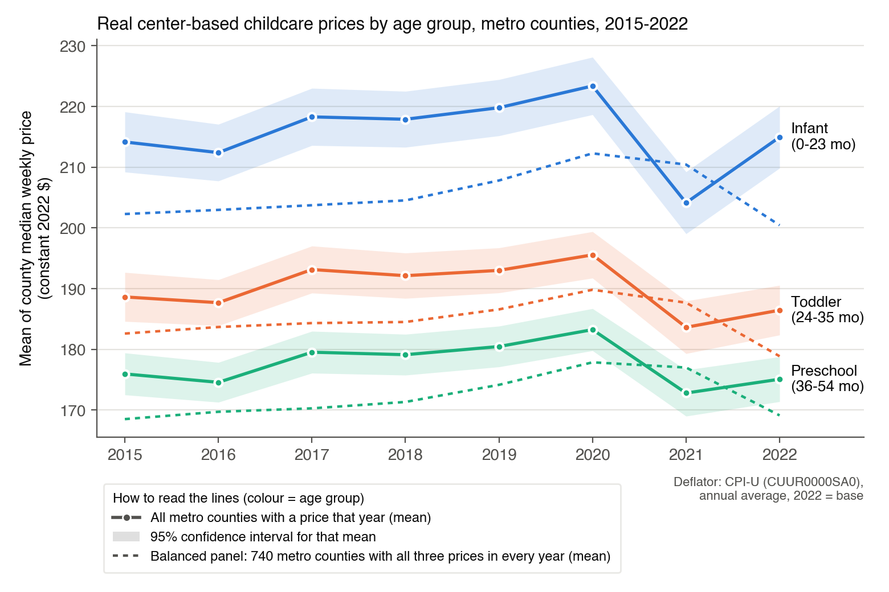
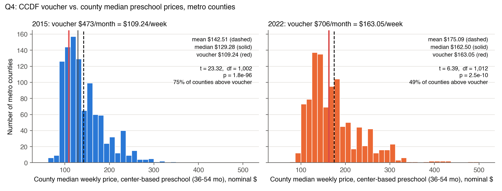
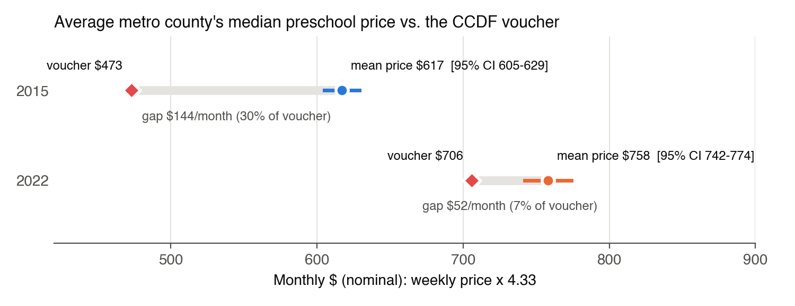

**Data.** DOL National Database of Childcare Prices (NDCP, 2024 release), variables `MCINFANT`, `MCTODDLER`,
`MCPRESCHOOL` — the county **median weekly full-time price of center-based care** (infant 0–23 months,
toddler 24–35 months, preschool 36–54 months), 2015–2022. These age groups are NDCP's own standard definitions (Technical Report,
Appendix C data dictionary): NDCP enters prices in 6-month age bands and combines them into the three groups; we
did not redefine them. All code, data
and the prompt history are in the project repository, <https://github.com/ignaciosanur/mgt403-childcare-project-green-cohort-7b>.

**Methods.** 95% confidence intervals use the large-sample (CLT) formula $\bar x \pm 1.96\, s/\sqrt n$. The
voucher test in Q4 uses the one-sample *t*-statistic with $n-1$ degrees of freedom. With $n > 1{,}000$ counties the
*t* and normal distributions are practically identical ($t_{0.975,\,1012} = 1.962$ vs. $1.960$), so the choice
does not affect any conclusion.

**Sample or population?** Our data cover every metro county with a reported price, not a random draw, so as a
*description of these counties* they are close to a population. We still use sample tools (SD with divisor $n-1$,
standard errors and CIs), as the assignment asks, for two reasons. (i) The question is about the underlying price
level (e.g. what the "average metro area" pays), and each year's county prices are one realization of it. (ii)
Each county value is itself an estimate from a state market-rate survey of providers. In practice the choice barely
matters: the population SD (divisor $n$) differs from the sample SD by 0.05% (preschool \$59.95 vs \$59.98). We do
*not* apply a finite-population correction for the ~222 metro counties without prices, because they are missing by
whole state (PA, IN, MO, NM, PR, AR), not at random.

# 1. Metro analysis sample

We merged NDCP to the course crosswalk `county_oews_crosswalk.csv` on county FIPS (5-character text) × year,
using **each year's own crosswalk row**, and kept counties whose `oews_area` begins with `00` (OEWS
metropolitan areas). All 25,763 NDCP county-year rows matched the crosswalk.

| Year | 2015 | 2016 | 2017 | 2018 | 2019 | 2020 | 2021 | 2022 |
|---|---|---|---|---|---|---|---|---|
| NDCP counties | 3,220 | 3,220 | 3,220 | 3,220 | 3,220 | 3,221 | 3,221 | 3,221 |
| Metro counties | 1,233 | 1,233 | 1,234 | 1,233 | 1,235 | 1,235 | 1,235 | 1,235 |
| … with preschool price | 1,003 | 1,025 | 1,063 | 1,063 | 1,063 | 1,063 | 918 | 1,013 |

The crosswalk lists 1,237 metro counties in 2022; the two not in NDCP are legacy codes for counties that NDCP
reports under their current code (12025 Dade → 12086 Miami-Dade; 51515 Bedford city → 51019 Bedford
County), so no metro county is lost. In 2022, 222 metro counties have no center-based price (all of Puerto
Rico, Indiana, Pennsylvania, Missouri and Arkansas, plus a few others): the state did not report usable data.

# 2. Distribution of 2022 prices by age group

| Center-based, 2022 (weekly \$) | N | Mean | Median | SD | SE = s/√n | 95% CI for the mean |
|---|---|---|---|---|---|---|
| Infant (0–23 months) | 1,012 | 214.95 | 198.93 | 82.96 | 2.61 | [209.84, 220.07] |
| Toddler (24–35 months) | 1,011 | 186.46 | 170.00 | 66.37 | 2.09 | [182.36, 190.55] |
| Preschool (36–54 months) | 1,013 | 175.09 | 162.50 | 59.98 | 1.88 | [171.39, 178.78] |

**Discussion.** Prices fall with the child's age: the average metro county charges about \$215/week for
infant care, \$186 for toddlers and \$175 for preschoolers. The three 95% CIs do not overlap, so the
differences are not sampling noise. Because the same counties report all three prices, a sharper
comparison is the within-county difference: infant care is on average \$28.5 more than toddler care
(SE 0.97, *z* ≈ 29) and \$39.8 more than preschool (SE 1.16, *z* ≈ 34); toddler exceeds preschool by
\$11.3 (SE 0.60, *z* ≈ 19).[^ties] Infant care costs more than preschool in 96% of counties, and the median county's infant price is 1.17× its
preschool price. This matches the cost structure of centers: state staff-to-child ratio rules require far
more teachers per infant (often 1:4) than per preschooler (often 1:10), and labor is the main cost.

All three distributions are **right-skewed** (skewness 1.3–1.4; mean above median). Most metro counties
sit between \$110 and \$250 a week, with a long tail of expensive, high-income metros (e.g. preschool at
Arlington VA \$496, San Francisco \$477, San Mateo \$437, Marin \$433). The spread is also larger for
younger children (SD \$83 vs \$60), both in dollars and relative to the mean (coefficient of variation 0.39 vs 0.34).

*Weighting.* The statistics above treat every metro county equally, since each county is one candidate market.
Weighting counties by their number of children under 6 (ACS 2022) raises the 2022 means to \$269 (infant),
\$226 (toddler) and \$211 (preschool). Large metro counties charge more, so the typical child faces higher prices
than the typical county.

# 3. Trends in real prices, 2015–2022

Nominal prices were converted to constant 2022 dollars with the CPI-U (series CUUR0000SA0, annual average):
$\text{real}_{t} = \text{nominal}_{t} \times \text{CPI}_{2022}/\text{CPI}_{t}$. CPI values (verified against the
BLS Public Data API as the mean of the 12 monthly values): 2015 237.017 · 2016 240.007 · 2017 245.120 ·
2018 251.107 · 2019 255.657 · 2020 258.811 · 2021 270.970 · 2022 292.655.

*Note on Q2 in real terms:* Q2's 2022 results are unchanged by the CPI-U adjustment, because 2022 is the base
year.[^q2real]

| Mean real price, 2022 \$/week | 2015 | 2016 | 2017 | 2018 | 2019 | 2020 | 2021 | 2022 |
|---|---|---|---|---|---|---|---|---|
| Infant (0–23 mo), all counties | 214.2 | 212.4 | 218.3 | 217.9 | 219.8 | 223.4 | 204.1 | 215.0 |
| Toddler (24–35 mo), all counties | 188.6 | 187.7 | 193.1 | 192.1 | 193.0 | 195.6 | 183.6 | 186.5 |
| Preschool (36–54 mo), all counties | 176.0 | 174.6 | 179.5 | 179.1 | 180.5 | 183.3 | 172.8 | 175.1 |
| Infant (0–23 mo), balanced panel | 202.3 | 203.0 | 203.7 | 204.5 | 207.8 | 212.3 | 210.4 | 200.4 |
| Toddler (24–35 mo), balanced panel | 182.6 | 183.7 | 184.3 | 184.5 | 186.6 | 189.8 | 187.7 | 178.9 |
| Preschool (36–54 mo), balanced panel | 168.5 | 169.7 | 170.3 | 171.3 | 174.2 | 177.9 | 177.0 | 169.1 |

**A caution on composition.** The set of reporting states changes from year to year. In 2021, California,
North Carolina, Pennsylvania and Virginia (all relatively high-price) are missing while Puerto Rico (69 low-price
counties) appears only in that year, so the drop in the all-county 2021 mean is mostly a change in *which*
counties are measured. We therefore also track a **balanced panel of 740 metro counties** that report all three
prices in every year (dashed lines), which isolates price changes within the same markets.

**Change in real prices over each period (%).** "All" = all metro counties (solid lines); "Bal." = balanced panel of 740 counties (dashed lines).

| Period | Infant (0–23 mo): All | Bal. | Toddler (24–35 mo): All | Bal. | Preschool (36–54 mo): All | Bal. | CPI-U |
|---|---|---|---|---|---|---|---|
| 2015→2020 | +4.3 | +4.9 | +3.7 | +3.9 | +4.1 | +5.5 | +9.2 |
| 2020→2021 | **−8.6** | −0.9 | **−6.1** | −1.1 | **−5.7** | −0.5 | +4.7 |
| 2021→2022 | **+5.3** | −4.7 | **+1.5** | −4.7 | **+1.3** | −4.5 | +8.0 |
| 2015→2022 | +0.4 | −0.9 | −1.2 | −2.0 | −0.5 | +0.4 | +23.5 |

**Discussion.** Childcare prices went through three phases.

1. **2015–2020: modest real growth.** Real prices rose about 4–5% in total (balanced panel: infant +4.9%,
   toddler +3.9%, preschool +5.5%). In nominal terms, prices rose about 1.5–3.5% a year, slightly faster than
   inflation.
2. **2021: the COVID-era dip in the solid lines is mostly a change in which states are measured.** Across all
   counties, real prices fell 8.6% (infant), 6.1% (toddler) and 5.7% (preschool). But the 2021 sample lacks
   California, North Carolina, Pennsylvania and Virginia (high-price states) and adds 69 low-price Puerto Rico
   counties. Within the same 740 counties, real prices dipped only 0.9%, 1.1% and 0.5%, and **nominal prices kept
   rising** (+3.8%, +3.5%, +4.2%). The data show no COVID price cut. The small real dip is inflation (+4.7%)
   slightly outpacing price increases.
3. **2022: the solid-line rebound is also composition; within the same counties real prices fell.** The
   all-county means rebound (+5.3%, +1.5%, +1.3%) because CA, NC and VA return to the data. In the balanced panel,
   nominal prices rose about 3% again (+2.9%, +2.9%, +3.2%), but 8.0% inflation cut real prices by 4.7%, 4.7% and
   4.5%, back to roughly their 2015 level.

**Interpretation and outlook.** Nominal childcare prices look remarkably steady, rising about 3–4% a year from
2019 through 2022, before, during and after COVID. That is consistent with our hypothesis that prices are stabilizing after the shock and
will keep rising. Because providers did not raise prices as fast as the 2021–22 inflation surge, real prices
should recover once inflation falls back below about 3%. This should be checked when post-2022 NDCP data are
released. A caveat on timing: NDCP prices come from state market-rate surveys run only every 2–3 years, with
NDCP interpolating the years in between, so the recorded series is smoother and later than actual price changes.[^covid]

**Infant premium.** In the solid lines, the infant premium over preschool appears to widen in 2022 (infant/preschool
ratio 1.18 in 2021 → 1.23 in 2022; gap \$31 → \$40). This is again the change in reporting states. Within the
same counties the premium has been stable to slightly *narrowing* (ratio 1.200 in 2015, 1.193 in 2020, 1.185 in
2022; gap \$33.8 → \$31.3). It is based on one year of data, so it is a trend to monitor rather than a finding.
The ordering infant > toddler > preschool holds in every year.

# 4. Is the CCDF voucher equal to the median preschool price in the average metro area?

The Administration for Children and Families (ACF) asserts that, in the average metro area, the CCDF voucher
equals the price of care at the median-priced center-based preschool. The unit of observation is the metro county:
$X_i$ is county $i$'s median weekly center-based preschool (36–54 months) price (`MCPRESCHOOL`), and $\mu$ is the
mean of $X_i$ across metro counties (the "average metro area").

**Putting the voucher in weekly terms.** NDCP prices are weekly and the voucher is monthly, so we convert with
4.33 weeks per month:

$$\mu_0^{2022} = \frac{\$706}{4.33} = \$163.05 \text{ per week}, \qquad \mu_0^{2015} = \frac{\$473}{4.33} = \$109.24 \text{ per week}.$$

Equivalently, one can multiply every weekly price by 4.33 and test against \$706 per month. Since this rescales
$\bar X$, $s$ and $\mu_0$ by the same factor, the test statistic is identical (shown below).

## (a) Hypotheses

The ACF claim is about a specific difference: the gap between **what the voucher pays** and **what care costs**.
Specifically, it is the difference between the 2022 CCDF monthly voucher for center-based preschool (\$706, or
\$163.05 per week) and the price charged by the median-priced center-based preschool, averaged across metro areas.
ACF asserts this difference is zero. In our data each county's `MCPRESCHOOL` is already the median-priced
center's weekly price in that county, so the claim concerns $\mu$, the mean of these county medians across metro
counties:

$$H_0:\ \mu = \mu_0 = \$163.05 \qquad \text{(the voucher exactly covers median-center preschool in the average metro area)}$$

$$H_1:\ \mu \neq \$163.05 \qquad \text{(the voucher and the median-center price differ in the average metro area)}$$

We test at significance level $\alpha = 0.05$. The alternative is **two-sided** because a difference in either
direction contradicts the claim.
If $\mu > \mu_0$, the voucher falls short and a family using it must pay the difference out of pocket at a
median-priced center. If $\mu < \mu_0$, the voucher exceeds the typical market price. The same hypotheses apply to
2015, with $\mu_0^{2015} = \$473/4.33 = \$109.24$ per week.

## (b) Test statistic: one-sample *t*

The one-sample *t*-statistic tests whether the underlying mean price $\mu$ equals the hypothesized mean $\mu_0$,
using the sample average $\bar X$ across metro counties as evidence. We treat the counties as a sample, so $s$
uses the divisor $n-1$ (see Methods):

$$t = \frac{\bar X - \mu_0}{SE(\bar X)} = \frac{\bar X - \mu_0}{s/\sqrt{n}}, \qquad t \sim t_{\,n-1} \text{ under } H_0.$$

Its elements, each computed separately from the 2022 metro sample:

* **Sample size** $n$: the number of metro counties with a non-missing 2022 center-based preschool price (as in Q2):
  $n = 1{,}013$, so the degrees of freedom are $n - 1 = 1{,}012$.
* **Sample mean**:
  $$\bar X = \frac{1}{n}\sum_{i=1}^{n} X_i = \$175.0885 \text{ per week}.$$
* **Sample standard deviation**:
  $$s = \sqrt{\frac{1}{n-1}\sum_{i=1}^{n} \left(X_i - \bar X\right)^2} = \$59.9800 \text{ per week}.$$
* **Standard error of the mean**:
  $$SE(\bar X) = \frac{s}{\sqrt{n}} = \frac{59.9800}{\sqrt{1013}} = \frac{59.9800}{31.8277} = 1.8845.$$
* **Hypothesized mean**:
  $$\mu_0 = \frac{706}{4.33} = \$163.0485 \text{ per week}.$$

**Manual calculation:**

$$t = \frac{175.0885 - 163.0485}{1.8845} = \frac{12.0400}{1.8845} = \mathbf{6.389}.$$

The same calculation in monthly terms (every element × 4.33) gives the identical statistic:

$$t = \frac{758.13 - 706}{259.71/\sqrt{1013}} = \frac{52.13}{8.160} = 6.389.$$

| Element | Weekly | Monthly (× 4.33) |
|---|---|---|
| $n$ | 1,013 | 1,013 |
| $\bar X$ | \$175.0885 | \$758.13 |
| $s$ | \$59.9800 | \$259.71 |
| $SE(\bar X) = s/\sqrt n$ | 1.8845 | 8.160 |
| $\mu_0$ | \$163.0485 | \$706.00 |
| $\bar X - \mu_0$ | \$12.0400 | \$52.13 |
| $t$ | **6.389** | **6.389** |

## (c) Software check and p-value

For a two-sided test, the p-value is the probability, under $H_0$, of a *t*-statistic at least as far from zero
as the one observed:

$$p = P\left(|T_{n-1}| \ge |t|\right) = 2\left[1 - F_{t,\,n-1}\left(|t|\right)\right],$$

where $F_{t,\,n-1}$ is the CDF of the *t* distribution with $n-1$ degrees of freedom. Python's
`scipy.stats.ttest_1samp(x, 706/4.33)` returns

$$t = 6.3889, \qquad p = 2\left[1 - F_{t,\,1012}(6.3889)\right] = 2.5 \times 10^{-10},$$

which matches the manual calculation. With $n$ this large the *t* and standard normal distributions are
nearly identical: the critical value is $t_{0.975,\,1012} = 1.962$ (vs. $z_{0.975} = 1.960$), and a large-sample
*z*-test gives $p = 2[1-\Phi(6.389)] = 1.7 \times 10^{-10}$. The conclusion is the same.

## (d) Interpretation

Since $|t| = 6.39 > t_{0.975,\,1012} = 1.962$ and $p \approx 2.5 \times 10^{-10} < 0.05$, we **reject $H_0$**.
If the voucher really equalled the average metro median price, a sample mean \$12 or more away from \$163.05
would almost never occur by chance. In 2022 the average metro county's median preschool price
(\$175.09/week, 95% CI [\$171.39, \$178.78], ≈ \$758/month) is about **\$12/week (≈ \$52/month, 7%) above the
voucher**, so a family relying only on the voucher would have to pay the difference at a median-priced center.[^cluster]

**Nuance: "median" and "average" refer to different levels.** The claim's "median-priced center" is the median
*across centers within an area*. That is already each data point: `MCPRESCHOOL` is a county's median price across
its providers. "In the average metro area" is the average *across areas*, which is what the *t*-test above tests.
If "average metro area" is read instead as the *typical* (median) metro county, the right tool is a **sign test**:
under $H_0$ each county is equally likely to be priced above or below the voucher, so the number above is
$\text{Binomial}(n, 0.5)$, and

$$z = \frac{\hat p - 0.5}{\sqrt{0.5 \times 0.5 / n}}, \qquad \hat p = \frac{\#\{X_i > \mu_0\}}{n}.$$

| Sign test (median across counties = voucher) | 2022 | 2015 |
|---|---|---|
| Median across counties vs. voucher (weekly) | \$162.50 vs. \$163.05 | \$129.28 vs. \$109.24 |
| Counties above / below the voucher | 496 / 517 | 753 / 250 |
| $\hat p$ (share above) | 0.490 | 0.751 |
| $z$ | −0.66 | 15.88 |
| p-value (exact binomial) | 0.53 | $4 \times 10^{-59}$ |
| Decision at 5% | **fail to reject** | reject |

So in 2022 **ACF is right about the typical metro county**: the voucher sits almost exactly at the median county
price. It is **wrong about the average**, because the price distribution is right-skewed and a tail of expensive
counties pulls the mean about \$52/month above the voucher. We keep the *t*-test on the mean as our main answer
because it matches the wording ("average") and parts (b)–(c).

**Repeating with 2015 data and the 2015 voucher (nominal prices vs. the nominal voucher):**

$$t = \frac{\bar X - \mu_0}{s/\sqrt n} = \frac{142.5075 - 109.2379}{45.1741/\sqrt{1003}} = \frac{33.2696}{1.4264} = \mathbf{23.32}, \qquad p = 2\left[1 - F_{t,\,1002}(23.32)\right] \approx 1.8 \times 10^{-96}.$$

| Element | 2015 (weekly) |
|---|---|
| $n$ (df $= n-1$) | 1,003 (1,002) |
| $\bar X$ | \$142.5075 |
| $s$ | \$45.1741 |
| $SE(\bar X) = 45.1741/\sqrt{1003} = 45.1741/31.6702$ | 1.4264 |
| $\mu_0 = 473/4.33$ | \$109.2379 |
| $t$ | **23.32** |
| $p$ | $\approx 1.8\times10^{-96}$ (effectively 0) |

We reject $H_0$ in 2015 as well, and by a much larger margin. In 2015 the voucher covered only 77% of the average
metro median preschool price (a \$33/week gap, about \$144/month), and 75% of metro counties had median prices
above the voucher. Between 2015 and 2022 the nominal voucher rose 49% while metro preschool prices rose about
23–24%, so the gap shrank from about 30% of the voucher to 7%. The voucher is much closer to market prices in
2022, but it is still significantly below the average. (Converting both years to 2022 dollars multiplies $\bar X$,
$s$ and $\mu_0$ by the same CPI factor, so the *t*-statistics are unchanged.)

*Robustness.* The metro analysis sample is a hard rule throughout: only counties in an OEWS metropolitan area
(`oews_area` beginning `00`). Using exactly the same 1,013 metro counties (2022), averaged within each of the
341 OEWS metro areas so that each area counts once, we still reject: 2022 mean \$175.33, $n = 341$ areas, $t = 4.33$,
$p = 2.0\times10^{-5}$; 2015 mean \$144.47, $t = 15.6$, $p \approx 10^{-41}$.

# Data-handling decisions

Code, run instructions and the full prompt history are in the project repository,
<https://github.com/ignaciosanur/mgt403-childcare-project-green-cohort-7b> (see `README.md` there).
The decisions below shaped the numbers in this write-up.

* **Metro definition** uses the year-specific crosswalk row (`oews_area` starts with `00`); FIPS codes are kept
  as 5-character strings and OEWS areas as 7-character strings throughout.
* **Missing prices** are left out (not imputed); N is reported for every statistic.
* **Legacy county codes:** two crosswalk metro codes (12025 Dade, 51515 Bedford city) have no NDCP row. NDCP reports
  these counties under their current codes (12086, 51019), so no county is lost.
* **Balanced panel for trends:** the states that report prices change from year to year (e.g. 2021 lacks CA, NC, PA
  and VA and adds Puerto Rico), so Q3 also tracks the 740 metro counties with all three prices in every year.
* **Sample vs. population:** we treat the metro counties as a sample (SD with divisor $n-1$, standard errors and
  tests); see Methods.
* **Weights:** all statistics are unweighted county averages. The child-weighted means in Q2 use ACS 2022
  5-year `kids_under6` (B23008_002E, from `pull_acs.py`). Connecticut's 7 metro counties drop out of that calculation
  because the 2022 ACS reports CT by planning region.
* **NDCP `_flag` columns (values 1/2/3)** do not mark imputations. They record how NDCP collapsed its detailed
  age bands into one age-group price (1 = all bands had the same price, 2 = the most common price, 3 = the
  highest of several modes; NDCP Technical Report, Appendix C county data dictionary, p. 66). All non-missing values are kept.
* **CPI-U** values were verified against the BLS API (series CUUR0000SA0, annual averages).

[^ties]: **Within-county comparison, 2022 metro counties.** The mean of the within-county differences equals the
difference of the group means (\$28.5, \$11.3, \$39.8, up to a few cents from the 1–2 counties missing one price);
pairing only makes the comparison more precise. The county-by-county split shows how often each gap exists:

    | County by county | Higher | Same price | Lower |
    |---|---|---|---|
    | Infant (0–23 mo) vs toddler (24–35 mo) | 92.4% | 4.9% | 2.7% |
    | Toddler (24–35 mo) vs preschool (36–54 mo) | 64.5% | 28.6% | 6.9% |
    | Infant (0–23 mo) vs preschool (36–54 mo) | 96.4% | 0.0% | 3.6% |

    The infant premium is nearly universal. Toddler and preschool care cost exactly the same in 29% of counties,
    likely because many state surveys do not separate these age bands. The \$11 average toddler premium therefore
    comes from roughly two-thirds of counties.

[^q2real]: **How Q2 changes with CPI-U-adjusted prices.** Real prices are nominal × CPI₂₀₂₂ / CPI_year. For 2022
the factor is 292.655 / 292.655 = 1, so every Q2 number (histograms, means, medians, SDs, CIs, within-county gaps)
is identical in nominal and in real 2022 dollars. The adjustment only matters when comparing across years (Q3, and
the 2015 part of Q4). More generally, deflating one year's data multiplies every price by the same constant *c*,
which rescales dollar-valued statistics but leaves the shape and all unit-free results unchanged:

    | Statistic | Effect of multiplying all prices by *c* |
    |---|---|
    | Mean, median, SD, SE, CI endpoints, within-county gaps | multiplied by *c* |
    | N, skewness, coefficient of variation, % of counties with a gap | unchanged |
    | z-statistics and p-values (e.g. infant vs preschool) | unchanged, since (c·x̄ − c·μ₀)/(c·s/√n) = (x̄ − μ₀)/(s/√n) |
    | Histogram shape, ranking of counties and of age groups | unchanged (only the x-axis is rescaled) |

    For example, expressed in 2015 dollars (*c* = 237.017 / 292.655 = 0.810) the 2022 preschool mean would be
    \$141.80 (SD \$48.58, 95% CI [\$138.81, \$144.79]), infant \$174.08 and toddler \$151.01, and every
    conclusion in Q2 stays the same.

[^covid]: **COVID restrictions and childcare prices (exploratory check).** We summarized state COVID restrictions,
March 2020–December 2021, from the Oxford COVID-19 Government Response Tracker (OxCGRT, US state totals;
`covid_check.py`, output `covid_state_restrictions_oxcgrt.csv`). States differed a lot: days under a required
stay-at-home order ranged from 0 (e.g. ND, SD, IA, NM) to over 300 (HI), and the average 2020 stringency index ranged
from 46 (ND) to 78 (NM). Among the 34 states with balanced-panel metro counties, **restriction intensity is
essentially unrelated to childcare price changes**. Correlations between stringency, stay-at-home or school-closure
days and the 2019→2022 or 2020→2021 real price change range from −0.18 to +0.28, which is weak and noisy with 34
states. The stricter half of states saw a 2019→2022 real preschool change of −2.3%, against −1.5% for the less strict
half. This is consistent with prices measured in the NDCP being driven more by general inflation and the survey
schedule than by local lockdowns. Open questions: effects on *capacity* (center closures, enrollment) and on costs
are not visible in price data. The NDCP series may also lag too much to show a short 2020–21 shock.

[^cluster]: **Caveat: counties in the same state are not independent.** Many states report prices by region or
cluster rather than county by county, so about 60% of metro counties share an exact price with another county in
their state. The textbook standard error $s/\sqrt n$ assumes 1,013 independent observations. The effective amount
of information is closer to the 45 states. Allowing for correlation within states (state-clustered standard errors,
$t$ with $G-1$ df) makes the standard error about 4.3 times larger:

    | State-clustered test of the mean | 2022 | 2015 |
    |---|---|---|
    | States (clusters) $G$ | 45 | 43 |
    | Clustered SE (vs. textbook SE) | 8.16 (vs. 1.88) | 6.10 (vs. 1.43) |
    | $t$ (df $= G-1$) | 1.48 (44) | 5.45 (42) |
    | p-value | 0.15 | $2.4 \times 10^{-6}$ |
    | 95% CI for the mean (weekly) | [\$158.64, \$191.54] | [\$130.20, \$154.82] |

    With clustered errors the 2022 interval **contains the voucher (\$163.05), so we would no longer reject in
    2022**. The 2015 rejection is robust. Our main answer uses the textbook test the assignment asks for; this
    caveat means the 2022 rejection is less certain than the textbook p-value suggests.
