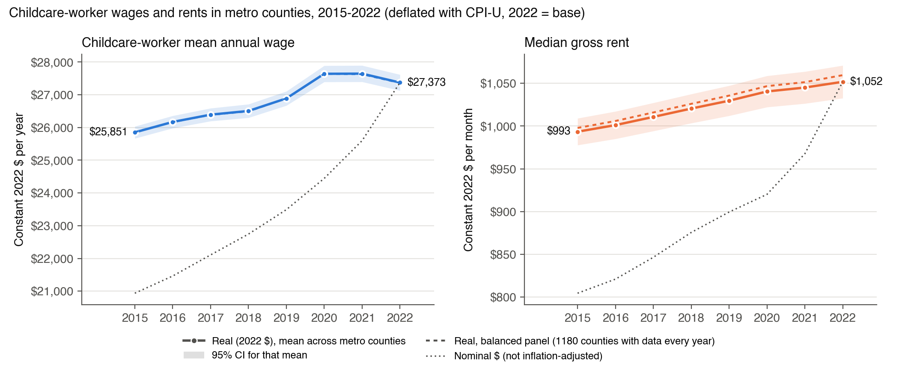

**Data.** Census American Community Survey (ACS) 5-year county estimates, 2015–2022, pulled with the Census API;
BLS Occupational Employment and Wage Statistics (OEWS) mean annual wage of **childcare workers (SOC 39-9011)** by
metropolitan/nonmetropolitan area, 2015–2022; the course crosswalk `county_oews_crosswalk.csv`; CPI-U (BLS series
CUUR0000SA0, annual averages) to convert to constant 2022 dollars. All code, data and the prompt history are in the
project repository, <https://github.com/ignaciosanur/mgt403-childcare-project-green-cohort-7b>.

**Methods.** The unit of analysis is the **metro county** (year × county), because the project's goal is to
recommend counties. This holds even though OEWS wages are published per metro area, so every county in an area
receives that area's wage. 95% confidence intervals use $\bar x \pm 1.96\, s/\sqrt n$; tests use *t* statistics. We
treat the metro counties as a sample (standard deviations with divisor $n-1$).

# 1. ACS 5-year estimates, 2015–2022

We queried the Census API (`acs/acs5`, `for=county:*`, `in=state:*`) for each vintage 2015–2022 and built the
derived variables exactly as specified:

| Derived variable | ACS construction |
|---|---|
| `per_capita_income` | B19301_001E |
| `pop_total` | B01001_001E |
| `kids_under6` | B23008_002E |
| `kids_under6_allpar_lf` | B23008_004E + B23008_010E + B23008_013E |
| `median_gross_rent` | B25064_001E |
| `female_college_share` | (B15002_032E + 033E + 034E + 035E) / B15002_019E |
| `female_ftyr_share` | B23022_029E / B23022_026E |
| `under6_share` | `kids_under6` / `pop_total` |
| `under6_careneed_share` | `kids_under6_allpar_lf` / `pop_total` |

The result covers 3,220 counties per year in 2015–2019, 3,221 in 2020–2021 and 3,222 in 2022 (25,764 county-years).
FIPS codes are kept as 5-character text, there are no duplicate county-years, all shares lie in [0, 1], and blanks
are rare (median gross rent is missing for 38 county-years, mostly very small rural counties). The year of an ACS
5-year file is its final survey year; e.g. the 2022 file pools 2018–2022 responses, and it is matched to 2022 data.

# 2. OEWS childcare-worker wages, 2015–2022

From each `oesmYYma.zip` file we read the metropolitan (`MSA_M20YY_dl.xlsx`) and nonmetropolitan
(`BOS_M20YY_dl.xlsx`) workbooks and, for 2015–2017, the aggregate-MSA workbook (`aMSA_M20YY_dl.xlsx`), since in
those years BLS reports the 11 largest metro areas in the MSA file only by metropolitan division. Those 11 areas (New
York, Los Angeles, Chicago, Dallas, Washington, Miami, Philadelphia, Boston, San Francisco, Detroit and Seattle) cover
114 metro counties (9.2%); without the aMSA file, they would have no wage in 2015–2017. From 2018 BLS publishes these
areas in the MSA file and no aMSA file exists. We kept occupation **39-9011 Childcare Workers**, variable `A_MEAN`
(mean annual wage, nominal \$). The area code was zero-padded to 7 characters (e.g. `10180` → `0010180`), so metro areas begin
with `00`. Cells that BLS suppresses (`*`) are set to missing.

| Year | 2015 | 2016 | 2017 | 2018 | 2019 | 2020 | 2021 | 2022 |
|---|---|---|---|---|---|---|---|---|
| Metro areas with a 39-9011 row | 426 | 426 | 428 | 392 | 392 | 384 | 389 | 384 |
| … of which from the aMSA file | 11 | 11 | 11 | – | – | – | – | – |
| Nonmetro areas with a 39-9011 row | 157 | 157 | 158 | 133 | 132 | 133 | 135 | 135 |
| Suppressed metro wages (`*`) | 1 | 1 | 0 | 0 | 0 | 1 | 0 | 0 |

# 3. Merging wages and ACS data to metro counties

We joined OEWS wages to counties on **[year, `oews_area`]** using the year-specific crosswalk, attached the ACS
variables on [year, county FIPS], labelled each county with its metro area (`area_title` from the crosswalk), and
kept only counties in an OEWS metropolitan area (`oews_area` begins with `00`). The result is identified by
year × county (`ps5_output/county_year_metro_2015_2022.csv`).

| Year | 2015 | 2016 | 2017 | 2018 | 2019 | 2020 | 2021 | 2022 |
|---|---|---|---|---|---|---|---|---|
| Metro counties | 1,233 | 1,233 | 1,234 | 1,233 | 1,235 | 1,235 | 1,235 | 1,235 |
| Missing childcare wage | 11 | 14 | 10 | 5 | 6 | 20 | 13 | 20 |
| % missing | 0.9% | 1.1% | 0.8% | 0.4% | 0.5% | 1.6% | 1.1% | 1.6% |

**Sanity check passed:** 0.4–1.6% of metro counties lack a wage, in line with the roughly 1% the assignment
expects, so the crosswalk merge worked. In 2022 the missing wages come from 12 metro areas for which BLS publishes
no 39-9011 estimate (Arecibo, Guayama and Mayagüez PR; Pine Bluff AR; Yuma AZ; Madera CA; Homosassa Springs FL;
Gadsden AL; Columbus IN; Bremerton-Silverdale WA; Fond du Lac and Janesville-Beloit WI).

# 4. Predictors in 2022

| Predictor (metro counties, 2022) | N | Mean | SD |
|---|---|---|---|
| Childcare-worker mean annual wage (OEWS 39-9011) | 1,215 | \$27,373 | \$4,337 |
| Per-capita income | 1,228 | \$36,156 | \$10,504 |
| Total population | 1,228 | 231,863 | 506,835 |
| Own children under 6 | 1,228 | 15,441 | 34,275 |
| Children under 6 with all parents in the labor force | 1,228 | 10,420 | 22,637 |
| Median gross rent (rent + utilities), per month | 1,227 | \$1,052 | \$342 |
| Share of women 25+ with a bachelor's degree or higher | 1,228 | 30.1% | 10.7 pp |
| Share of women 16–64 working full-time, year-round | 1,228 | 43.7% | 6.8 pp |
| Share of the population under 6 | 1,228 | 6.3% | 1.2 pp |
| Share of the population under 6 with all parents working | 1,228 | 4.2% | 0.9 pp |

Population-based variables are very right-skewed (a few large counties such as Los Angeles, with 9.9 million
residents, sit far above the mean). N differs across rows because 20 counties lack an OEWS wage and the 7
Connecticut metro counties have no 2022 ACS match.[^ct]

# 5. Real wages and rents, 2015–2022

Dollar values are converted to constant 2022 dollars: $\text{real}_t = \text{nominal}_t \times
\text{CPI}_{2022}/\text{CPI}_t$ (CPI-U annual averages, verified against the BLS API: 2015 237.017 · 2016 240.007
· 2017 245.120 · 2018 251.107 · 2019 255.657 · 2020 258.811 · 2021 270.970 · 2022 292.655).

| Mean across metro counties, 2022 \$ | 2015 | 2016 | 2017 | 2018 | 2019 | 2020 | 2021 | 2022 |
|---|---|---|---|---|---|---|---|---|
| Childcare-worker wage, per year | 25,851 | 26,170 | 26,393 | 26,506 | 26,889 | 27,641 | 27,646 | 27,373 |
| Median gross rent, per month | 993 | 1,001 | 1,011 | 1,020 | 1,030 | 1,040 | 1,045 | 1,052 |

**Discussion.** In nominal terms both costs rose about 31% from 2015 to 2022, but general inflation was 23.5%, so in
real terms each rose about 6%. Their paths differ:

* **Childcare-worker wages** grew faster than inflation through 2020 (+6.9% real, 2015–2020), stayed flat in 2021,
  and **fell 1.0% in real terms in 2022**, when the 8% inflation surge outpaced nominal raises.
* **Rents** rose steadily every year (+4.7% real, 2015–2020, and +1.1% more by 2022), without the 2022 reversal.

Unlike the NDCP prices in PS4, the set of counties is nearly the same each year, so the balanced panel (1,180
counties with both variables in every year, dashed lines) tracks the full sample almost exactly.

# 6. Did real childcare-worker wages rise between 2019 and 2022?

Providers claim rising wages were an important driver of higher costs after Covid-19. We test whether average real
wages (2022 \$) of childcare workers in metro counties were the same in 2022 as in 2019.

**Hypotheses** (two-sided, $\alpha = 0.05$):

$$H_0:\ \mu_{2022} = \mu_{2019} \qquad \text{(average real childcare wage was the same in 2022 as in 2019)}$$

$$H_1:\ \mu_{2022} \neq \mu_{2019} \qquad \text{(average real childcare wage changed between 2019 and 2022)}$$

**Test: two-sample *t*-test with unequal variances (Welch).** The two years are independent samples: OEWS pools
three years of survey panels into each May estimate, and the May 2019 estimate (panels Nov 2016–May 2019) shares no
survey data with May 2022 (panels Nov 2019–May 2022). We use Welch's version rather than a one-way ANOVA (which with
two groups is the pooled-variance *t*-test) **because the spread of wages differs between the two years**: the 2022
SD (\$4,337) is 11% larger than the 2019 SD (\$3,897), and a Bartlett test rejects equal variances (p = 0.0002).
Welch's test does not assume the two variances are equal.[^anova]

$$t = \frac{\bar X_{2022} - \bar X_{2019}}{\sqrt{\dfrac{s_{2022}^2}{n_{2022}} + \dfrac{s_{2019}^2}{n_{2019}}}}, \qquad
\nu = \frac{\left(\dfrac{s_{2022}^2}{n_{2022}} + \dfrac{s_{2019}^2}{n_{2019}}\right)^2}
{\dfrac{(s_{2022}^2/n_{2022})^2}{n_{2022}-1} + \dfrac{(s_{2019}^2/n_{2019})^2}{n_{2019}-1}}$$

| Element | 2022 | 2019 |
|---|---|---|
| $n$ (metro counties with a wage) | 1,215 | 1,229 |
| $\bar X$ (mean real wage, 2022 \$) | \$27,373.48 | \$26,888.87 |
| $s$ (SD) | \$4,337.10 | \$3,897.24 |
| $s^2/n$ | 15,481.85 | 12,358.43 |

$$SE = \sqrt{15{,}481.85 + 12{,}358.43} = 166.85$$

$$t = \frac{27{,}373.48 - 26{,}888.87}{166.85} = \frac{484.61}{166.85} = \mathbf{2.90}, \qquad \nu = 2{,}408.5 \text{ degrees of freedom}$$

$$p = 2\left[1 - F_{t,\,\nu}(2.90)\right] = \mathbf{0.0037}.$$

`scipy.stats.ttest_ind(..., equal_var=False)` returns the same $t = 2.904$ and $p = 0.0037$. The 95% CI for the
change is [\$158, \$812] per year.

**Interpretation.** Since $|t| = 2.90 > 1.96$ and $p = 0.004 < 0.05$, **we reject $H_0$**: average real
childcare-worker wages were higher in 2022 than in 2019, by about **\$485 a year (+1.8%)**. The increase is
statistically significant but economically small:

* In nominal terms wages rose 16.5% from 2019 to 2022, but CPI-U rose 14.5%. Wage growth largely matched general
  inflation.
* Real wages peaked in 2020–2021 and fell in 2022 (section 5).

**On the providers' claim:** labor costs did rise, and slightly faster than inflation, so wages contributed to cost
pressure. They are not a dramatic post-Covid shock, though: real wages rose less than 2% over three years. The
claim gains weight relative to prices. In the same metro counties, real center-based preschool (36–54 months)
prices *fell* 3.9% between 2019 and 2022 (PS4 data, 991 counties). The wage bill therefore rose about 6% relative
to what centers charge, a margin squeeze consistent with providers' complaints, even though wages did not surge.[^paired]

# 7. Regression: wages on female college share, 2022

$$\text{wage}_i = a + b \times \text{female\_college\_share}_i + e_i, \qquad i = \text{metro county, 2022}$$

`female_college_share` is a fraction (0 to 1).

| | Coefficient | Std. error | *t* | p-value | 95% CI |
|---|---|---|---|---|---|
| Intercept $a$ | \$22,359 | 339 | 65.9 | < 0.001 | [\$21,694, \$23,025] |
| Female college share $b$ | **\$16,500** | 1,058 | **15.59** | $4.5\times10^{-50}$ | [\$14,424, \$18,576] |

$N$ = 1,208 metro counties (with both a wage and ACS data), $R^2 = 0.168$.

**Can we reject that the coefficient is zero?** Yes. For $H_0: b = 0$ vs. $H_1: b \neq 0$,
$t = b/SE(b) = 16{,}500/1{,}058 = 15.59$, far beyond the 5% critical value of 1.962 ($p \approx 10^{-50}$).

**Interpretation.** A county whose share of college-educated women is **10 percentage points higher** has, on
average, childcare-worker wages about **\$1,650 a year higher** (6% of the mean wage). Moving from a county at 20% to
one at 40% predicts about \$3,300 more per year. This is an association, not a causal effect: a high female college
share marks richer, higher-cost metro areas (where childcare centers must pay more to attract staff, and where
more working mothers demand care). The share explains 17% of the variation in childcare wages across counties, so
other local factors matter a lot.[^cluster]

# Data-handling decisions

* **Metro sample** uses the year-specific crosswalk row (`oews_area` begins with `00`); FIPS codes are 5-character
  and OEWS areas 7-character strings throughout.
* **County as the unit of analysis**, including for the OEWS wage, which is measured per metro area.
* **Legacy county codes:** two crosswalk metro codes (12025 Dade, 51515 Bedford city) duplicate counties reported
  under current codes (12086, 51019) and are dropped.
* **Connecticut 2022:** the 2022 ACS reports Connecticut by 9 planning regions instead of its 8 counties, so its 7
  metro counties have no 2022 ACS values. They are kept in the panel but drop out of analyses that need ACS
  variables (1.2% of the metro population; not influential).
* **OEWS files for 2015–2017** include the aggregate-MSA workbook (`aMSA_`), which holds the 11 largest metro
  areas that the MSA file reports only by metropolitan division (114 metro counties).
* **Suppressed or missing OEWS wages** stay missing (not imputed); N is reported for every statistic.
* **ACS vintages** are matched to the data year by their final survey year.
* **CPI-U** values were verified against the BLS API; real \$ = nominal × CPI₂₀₂₂ / CPI_year.

[^ct]: Connecticut switched its census geography to planning regions in the 2022 ACS, while the NDCP and the course
crosswalk still use the old counties. Its 7 metro counties hold 3.4 million people (1.2% of the metro population)
and are not outliers, so we drop them from 2022 analyses that use ACS variables rather than re-mapping regions to
counties.

[^anova]: **Same conclusion with ANOVA.** A one-way ANOVA of real wages on year (2019 vs. 2022), which assumes equal
variances, gives $F = 8.45$ with $p = 0.0037$. With two groups $F$ equals the pooled-variance *t* squared
($t = 2.906$, $2.906^2 = 8.45$), and the p-value is identical to Welch's to three decimals. A Levene test, which is
less sensitive to the slight skew in wages, does not reject equal variances ($p = 0.12$). Either way we reject $H_0$,
so the choice of test does not change the conclusion. The non-parametric Mann–Whitney test also rejects ($p = 0.008$).

[^paired]: **Paired version.** Because the same counties appear in both years, the change can also be measured
within each county: the mean county-level change is +\$456 (SE \$53), $t = 8.58$, $p < 0.001$, and wages rose in 62%
of counties. This test is more precise but leads to the same conclusion.

[^cluster]: Counties in the same metro area share one OEWS wage, so they are not fully independent observations.
Allowing for this (standard errors clustered by metro area, 373 areas) raises the standard error of $b$ to 2,217;
$t = 7.44$ still rejects $b = 0$ by a wide margin.
